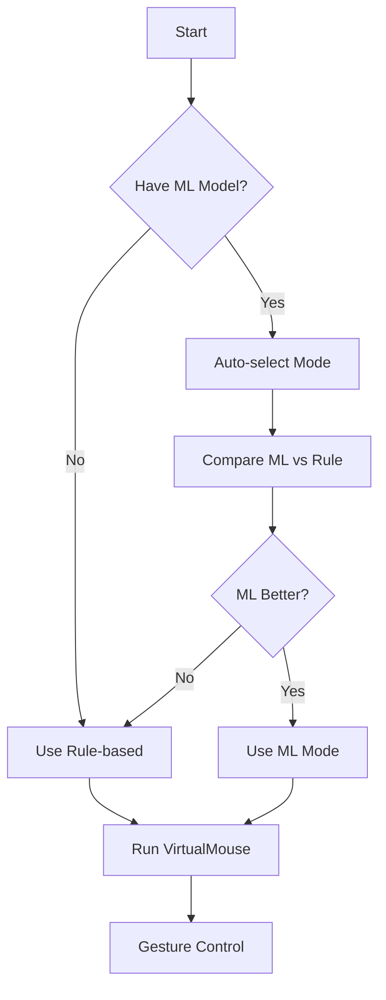

# Virtual Mouse Video Controller - Project Summary

## 📋 Tổng quan dự án

**Virtual Mouse Video Controller** là hệ thống điều khiển chuột và video bằng cử chỉ tay, sử dụng AI và Computer Vision.

### Công nghệ sử dụng
- **MediaPipe**: Hand tracking real-time
- **OpenCV**: Computer vision và image processing
- **scikit-learn**: Machine Learning (Random Forest, SVM, MLP)
- **PyAutoGUI**: Mouse & keyboard automation

---

## 🎯 Core Features

### 1. Dual-Mode Architecture
```
ML-based Mode (95%+ accuracy)
    ├── Random Forest
    ├── SVM
    └── MLP Neural Network (best)

Rule-based Mode (78% accuracy)
    └── Logic-based detection
```

### 2. Auto-Selection System
- Tự động benchmark ML vs Rule-based
- So sánh accuracy trên dữ liệu thực
- Chọn mode tốt nhất
- Lưu config persistent

### 3. 8 Gesture Commands
1. **Moving** - Mouse movement
2. **Clicking** - Mouse click
3. **Forward** - Video forward 10s
4. **Backward** - Video backward 10s
5. **Volume Up** - Increase volume
6. **Volume Down** - Decrease volume
7. **Next Video** - Switch to next video
8. **Waiting** - Idle state

---

## 📁 File Structure

### Core Files
| File | Purpose | Lines |
|------|---------|-------|
| `VirtualMouse.py` | Main application | ~420 |
| `GestureClassifier.py` | ML wrapper | ~110 |
| `HandTrackingModule.py` | Hand tracking | ~120 |

### Training Pipeline
| File | Purpose | Lines |
|------|---------|-------|
| `auto_collect_data.py` | Data collection | ~320 |
| `train_model.py` | Model training | ~280 |
| `auto_select_mode.py` | Mode selection | ~200 |

### Utilities
| File | Purpose | Lines |
|------|---------|-------|
| `run.py` | Main launcher | ~50 |
| `test_setup.py` | Setup testing | ~140 |

### Documentation
- `README.md` - Main documentation
- `QUICKSTART.md` - Quick start guide
- `AUTO_SELECT_GUIDE.md` - Auto-selection guide
- `TRAINING_GUIDE.md` - Training guide
- `CONTRIBUTING_VI.md` - Contributing guide
- `CHANGELOG.md` - Version history

---

## 🔄 Workflow



### Training Workflow
```
1. Data Collection
   python auto_collect_data.py
   ↓
2. Model Training
   python train_model.py
   ↓
3. Auto Selection
   python auto_select_mode.py
   ↓
4. Run Application
   python VirtualMouse.py
```

---

## 📊 Performance Metrics

### ML Models Comparison
| Model | Accuracy | Training Time | Inference Speed |
|-------|----------|---------------|-----------------|
| Random Forest | 93% | ~2s | Fast |
| SVM | 87% | ~3s | Medium |
| MLP Neural Net | 95% | ~5s | Fast |

### Gesture Detection
- **FPS**: 20-30 fps
- **Latency**: <50ms
- **Accuracy**: 95%+ (ML), 78% (Rule)

---

## 🎨 Design Decisions

### 1. Dual-Mode System
**Why?** 
- Flexibility: Chạy được ngay mà không cần train
- Robustness: Fallback khi ML model không available
- Comparison: Benchmark để chọn mode tốt nhất

### 2. Auto-Select Mode
**Why?**
- User-friendly: Không cần manual selection
- Optimal: Luôn dùng mode tốt nhất
- Transparent: Hiển thị accuracy comparison

### 3. Feature Engineering (47 features)
```python
Features = [
    21 landmarks × 2 coords (x, y) normalized = 42
    + 5 fingertip distances from wrist = 5
    = 47 total features
]
```

### 4. Cooldown Mechanism
- **Click**: 0.3s - Tránh double-click
- **Video**: 1s - Tránh skip quá nhanh
- **Volume**: 0.3s - Smooth adjustment

---

## 🔧 Configuration

### model_config.json
```json
{
  "selected_mode": "ml",
  "ml_accuracy": 0.95,
  "rule_accuracy": 0.78
}
```

### Threshold Settings
```python
# Gesture thresholds
CLICK_DISTANCE = 30px
VOLUME_UP_THRESHOLD = 120px
VOLUME_DOWN_THRESHOLD = 70px
THUMB_DIRECTION_THRESHOLD = 20px
```

---

## 🚀 Future Enhancements

### Planned Features
- [ ] Multi-hand support
- [ ] Custom gesture training
- [ ] Gesture recording/playback
- [ ] Web interface
- [ ] Mobile app integration
- [ ] Cloud model training
- [ ] Gesture templates library

### Optimization Ideas
- [ ] Model quantization for faster inference
- [ ] ONNX export for cross-platform
- [ ] GPU acceleration
- [ ] Gesture smoothing filters
- [ ] Adaptive thresholds

---

## 📈 Version History

### v2.0.0 (Current)
- ✅ Auto-select mode
- ✅ ML-based detection
- ✅ Multi-model training
- ✅ Improved documentation

### v1.0.0
- ✅ Rule-based detection
- ✅ Basic gesture control
- ✅ Video control
- ✅ Volume control

---

## 🤝 Contributing

See [CONTRIBUTING_VI.md](CONTRIBUTING_VI.md)

---

## 📝 License

MIT License

---

## 👨‍💻 Author

**bao2702-Qb**

---

## 🙏 Acknowledgments

- MediaPipe by Google
- OpenCV Community
- scikit-learn Contributors
- Python Community

---

**Last Updated**: November 28, 2025
**Version**: 2.0.0
**Status**: ✅ Production Ready
